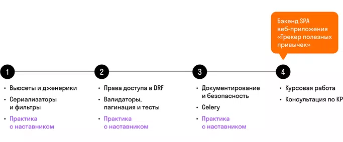

# О курсе DRF

> Вы приступаете к изучению курса DRF, на котором будете знакомиться с основными концепциями и инструментами Django REST framework (DRF) для разработки мощных и масштабируемых RESTful API.

## Структура курса DRF

## Ключевые навыки курса
### На уроках курса вы:

- создадите API сервиса (прослойку) для работы фронтенда,
- реализуете распределение прав доступа,
- покроете код проекта тестами и сформируете документацию перед передачей фронту,
- реализуете асинхронную отправку уведомлений пользователям.
## Проект курса
В домашних заданиях курса вы реализуете платформу для онлайн-обучения, на которой каждый желающий сможет размещать свои полезные материалы или курсы.

Вы будете работать над SPA-приложением. Результатом создания проекта будет бэкенд-сервер, который возвращает клиенту JSON-структуры.

## Механики уроков
Каждый урок состоит из определенных разделов, которые помогают разобраться в теме:

- Контент урока — посмотрите видео, повторите решение за экспертом, изучите конспект под видео, прорешайте тесты и зафиксируйте для себя ключевые моменты.
- Вопросы для самопроверки — проверьте себя в формате прохождения собеседований, устно ответьте на вопросы и сравните с ответами в спойлерах.
- Задачи — попрактикуйтесь в работе с чужим кодом: разберитесь в решении проекта и ответьте на вопросы по нему, а также найдите ошибки, исправьте их и почините решение.
- Подготовка к практике — попрактикуйтесь в решении задач, изучите решение наставника и подготовьтесь к прохождению собеседований в формате лайв-кодинга.
- Итоги — закрепите ключевые моменты урока и подведите итоги.
- Шпаргалка — перечитайте целиком и закрепите материал урока, зафиксируйте вопросы, которые у вас остались, чтобы обсудить с наставником и одногруппниками.
- Домашнее задание — отработайте практический навык в решении задач по теме урока.
- Практика с наставником (лайв в выходной день) — задайте наставнику вопросы по теме урока, ответьте на вопросы в формате прохождения интервью и прорешайте задачи в реальном времени.
## Содержание уроков
### 1. Вьюсеты и дженерики
В первой части курса вы познакомитесь с основами DRF, изучите настройку и использование ViewSet и Generic. Вы узнаете, как работать с этими инструментами для создания эффективных контроллеров API, объединяющих логику обработки запросов и предоставляющих готовые функции для CRUD-операций над ресурсами.

### Ваши хард-скилы

После изучения урока вы сможете:

- настраивать DRF,
- использовать Postman,
- описывать простой сериализатор,
- описывать контроллер на базе вьюсета,
- описывать REST-запросы для вьюсета,
- модифицировать контроллеры на основе вьюсета,
- описывать вьюсеты в урлах,
- описывать контроллер на базе дженерика,
- использовать правильные дженерики для определенных задач,
- переопределять контроллеры для разных запросов,
- реализовывать RESTful на основе дженериков.
### 2. Сериализаторы и фильтры
На этом уроке вы узнаете, как использовать базовые сериализаторы для преобразования сложных типов данных в форматы, понятные для передачи по сети. Вы также изучите, как применять фильтры для извлечения и отображения конкретных данных из вашего API.

### Ваши хард-скилы

После изучения урока вы сможете:

- описывать сериализатор,
- настраивать отображение,
- переопределять поля в сериализаторе,
- реализовывать вложенность в сериализаторе,
- подключать фильтрацию к контроллеру,
- настраивать кастомную фильтрацию.
### 3. Права доступа в DRF
На этом уроке вы рассмотрите вопросы безопасности и авторизации в DRF. Изучите различные методы аутентификации, включая JWT, а также научитесь настраивать права доступа на уровне моделей и контроллеров, чтобы обеспечить безопасность вашего API.

### Ваши хард-скилы

После изучения урока вы сможете:

- подключать к DRF-проекту JWT,
- описывать авторизацию для пользователя,
- устанавливать права на модель,
- устанавливать права на объект,
- кастомизировать права доступа,
- задавать права доступа на контроллер,
- кастомизировать права доступа на контроллер.
### 4. Валидаторы, пагинация и тесты
Вы узнаете, как использовать валидаторы для проверки и валидации данных, а также как настроить пагинацию для управления большими объемами данных в вашем API. Вы также научитесь писать тесты, чтобы убедиться в корректности работы вашего API.

### Ваши хард-скилы

После изучения урока вы сможете:

- описывать валидатор в сериализаторе,
- подключать пагинацию и настраивать ее,
- описывать unittest,
- запускать тесты для отдельных приложений,
- считывать покрытие тестами.
### 5. Документирование и безопасность
В завершающей части курса вы узнаете, как создавать документацию для вашего API, чтобы облегчить его использование другим разработчикам. Вы также рассмотрите вопросы безопасности (CORS) и разберетесь, как происходит интеграция с другими сервисами для обеспечения безопасности вашего API.

### Ваши хард-скилы

После изучения урока вы сможете:

- подключать к проекту Swagger или ReDoc,
- настраивать автогенерируемую документацию в проекте,
- описывать настройки для вывода документации вручную,
- подключать пакет для работы с CORS,
- настраивать CORS для проекта.
### 6. Celery
В конце курса вы познакомитесь с Celery — инструментом для выполнения отложенных и периодических задач. Вы научитесь настраивать Celery и использовать его для обработки фоновых задач в вашем приложении.

## Ваши хард-скилы

После изучения урока вы сможете:

- настраивать проект для работы с Celery,
- подключать брокер,
- создавать отложенные задачи,
- создавать периодические задачи.
> Рекомендуем активно практиковаться: решать задачи, работать с кодом и разрабатывать проекты. Это поможет закрепить полученные знания и стать уверенным разработчиком RESTful API с использованием Django REST framework.

>> Удачи при изучении курса!
